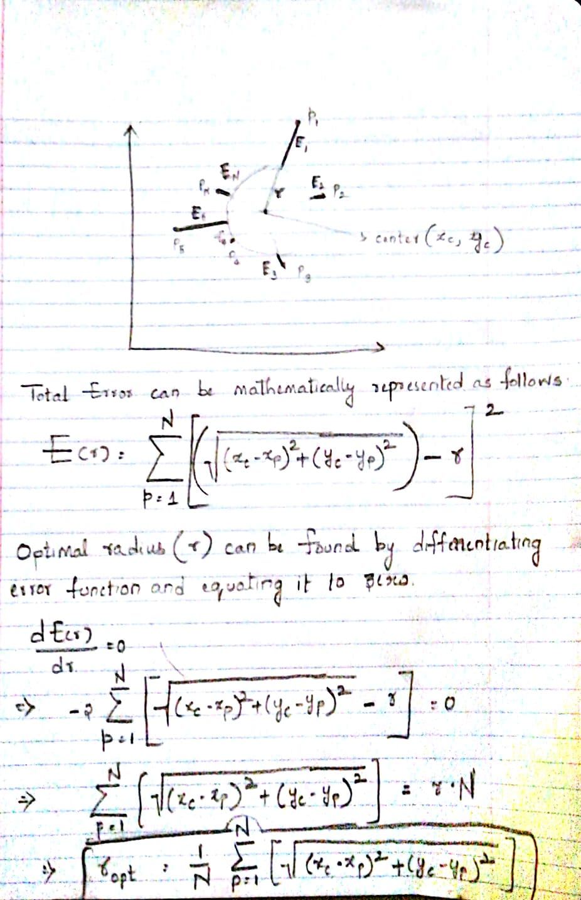

# Circles Game

This repository includes two circles game which are briefed below

# Circles 1

A program capable of digitizing circles in a 20x20 grid.
The user can click to place the center of a circle, and then drag to
set its radius. The circle would be drawn on the screen.

The program will highlight the points (make them blue) that correspond to the edge of the digital circle, in a way such that the points can be connected to reconstruct the circle.

Then, two additional circles would be created corresponding to the largest and smallest radius of the highlighted points.

## Getting Started

These instructions will get you a copy of the project up and running on your local machine for development and testing purposes. See deployment for notes on how to deploy the project on a live system.

### Dependencies

Python 2.7  
*See [Installing python](https://www.python.org/download/releases/2.7/) for instructions on how to install python.*  
Pygame 1.9.3  
*See [Installing pygame](https://cit.dixie.edu/cs/1410/pygame-installation.pdf) for instructions on how to install pygame.*

## How to run

open a terminal or console. Change the operating directory to where the ```circles_1.py``` is  and type in

```
python circles_1.py
```

## Program structure

The program function ```create_game_env()``` to a game environment in pygame with 20x20 grids and digitalizes the grid points.

Then the program calls the ``` main() ``` function which monitors mouse clicks.  
When a click is recorded the pixel position of the click is converted to a digital point. When a unclick is recorded the radius of the circle is computed and the ```compute_circle() ``` function is called to draw the circles.

The compute_circle function takes the center of the circle the radius and the digital grid as arguments. It iterates through all the pixel points in an imaginary square that circumscribes the circle and appends all the pixel points(x,y) that satisfies the circle equation to a list named ` circle[]`. It then places a dot in all these pixel points.

The program then iterates through each point(pixel point) in the list `circle[]` to get the closest digital points to the pixel points. Computed by calculating the euclidean distance between every digital point and the pixel points in the list `circle[]`. All the digital points touching the circle are highlighted.

A maximum and minimum radius is computed between the center of the circle and the digital points touching the circle. Then two circles are draw with the max and min as the radius


# Circles 2

A program capable of digitizing circles in a 20x20 grid.
The user can  toggle points on the grid on and off. When the user clicks the generate button, a circle would be generated that best fits the highlighted points.

### Dependencies

Same as circles 1

## How to run

open a terminal or console. Change the operating directory to where the ```circles_2.py``` is  and type in

```
python circles_2.py
```

## Program structure

The program function ```create_game_env()``` to a game environment in pygame with 20x20 grids and digitalizes the grid points.

Then the program calls the ``` main() ``` function which monitors mouse clicks.  
When a click is recorded the pixel position of the click is appended to a list `circle[]`. When the generate button is clicked the mean and standard deviation(S.D) of the points is calculated and the points which are not in the median (+-) 2* SD are removed(outliers).

The optimal circle radius computation is shown in the image attached



another method is used where in all the possible circles that can be drawn with the digital points are taken and the least square error is computed for all these points. The circle with the minimum least square error is selected


## Authors

* **Rakshith Subramanyam** -  [github](https://github.com/Rakshith-2905)


## License

None
